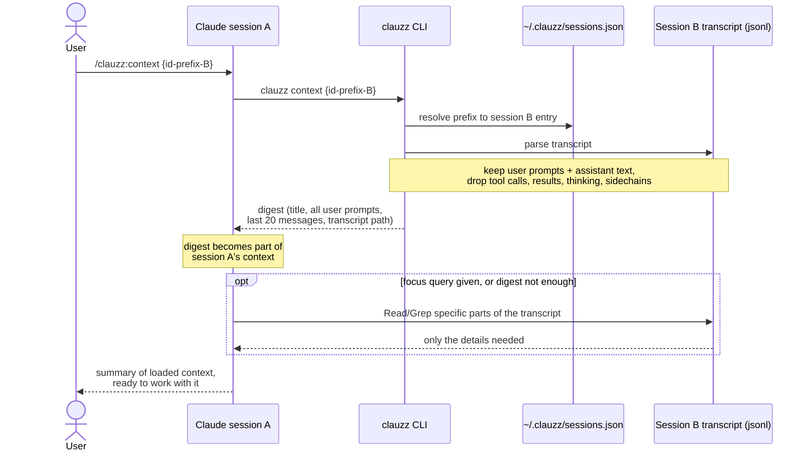

# clauzz


[](https://github.com/ghulammuzz/clauzz-cli/releases/latest)
[](https://github.com/ghulammuzz/clauzz-cli/actions)
[](https://goreportcard.com/report/github.com/ghulammuzz/clauzz-cli)
[](LICENSE)

**Workspace context manager for AI coding agents.**

AI coding agents scatter your work across sessions identified only by anonymous UUIDs.
`clauzz` turns them into a managed workspace.

Today clauzz supports Claude Code; adapters for other agents are on the roadmap.


## Features

- **Name your sessions**: `evoucher close-loop` instead of `70c79231-...`.
- **Resume in one keypress**: a TUI picker grouped by directory, enter execs `claude --resume` in the right project.
- **Search everything**: full-text search across every session on the machine, registered or not.
- **Carry context between sessions**: `/clauzz:context` injects a digest of one session into another.
- **Slash commands inside Claude Code**: register, list, and pull context without leaving your session.

## Install

Linux / macOS:

```sh
curl -sSL https://clauzz.muzz-ai.com/install.sh | sh
```

The script downloads the latest release binary for your platform, verifies its checksum, installs it, and installs the Claude Code slash commands.
Windows is not supported (resume uses `exec(2)`).

<details>
<summary>Other install methods</summary>

With Go installed:

```sh
go install github.com/ghulammuzz/clauzz-cli/cmd/clauzz@latest
```

Build from source:

```sh
go build -o clauzz ./cmd/clauzz && mv clauzz /usr/local/bin/
```

Slash commands only (if you skipped the install script):

```sh
mkdir -p ~/.claude/commands/clauzz && cp claude-command/*.md ~/.claude/commands/clauzz/
```

</details>

## Usage

### CLI

| Command | What it does |
|---------|--------------|
| `clauzz` | Interactive picker; enter resumes the session via `claude --resume` in its directory |
| `clauzz add {name}` | Register the current Claude session under a custom name |
| `clauzz list` | List registered sessions grouped by directory (`ls` works too) |
| `clauzz search {query}` | Full-text search across every session on the machine |
| `clauzz context {id-prefix} [focus...]` | Print the context digest of a session (powers `/clauzz:context`) |
| `clauzz rename {id-prefix} {new-name}` | Rename a registered session |
| `clauzz rm {id-prefix}` | Remove a session from the registry (`delete` works too) |
| `clauzz prune` | Drop all `[gone]` entries whose transcript was deleted |

Session ID prefixes need at least 4 characters.

### Slash commands (inside Claude Code)

| Command | What it does |
|---------|--------------|
| `/clauzz:add-session {name}` | Register the current session under a custom name |
| `/clauzz:list` | Show registered sessions |
| `/clauzz:context {id-prefix} [focus query]` | Load another session's context into this one |

Example:

```
$ clauzz ls
/Users/demo/code/shop-api
  Task Kafka DLQ                 3f2a8c1e   2026-07-10 16:15
  Fix payment webhook            8b91d4f7   2026-07-09 21:00
/Users/demo/code/shop-web
  Checkout revamp                e15fb3c8   2026-07-10 23:45

$ clauzz rm 8b91
removed "Fix payment webhook" (8b91d4f7) in /Users/demo/code/shop-api
```

## Demos

### Register a session from Claude Code

1. Open your project and start a session: `claude` (or resume an old one).
2. Type `/clauzz:add-session {name}`, e.g. `/clauzz:add-session Demo Session`.
3. Claude confirms the registration: `Session "Demo Session" registered -> 84409ceb in ...`.
4. From then on the session shows up in `clauzz ls` and the `clauzz` picker under that name.

Re-running `/clauzz:add-session` in the same session just renames it (the registration is an upsert).


### Search across every session

Which session talked about kafka? `clauzz search` answers from every transcript on the machine, registered in clauzz or not.


### Carry context between sessions

Inside Claude Code, `/clauzz:context {id-prefix} [focus query]` injects a digest of another session into the active one.
The GIF shows the digest that gets injected: title, user prompts, last messages, and the focus query for Claude to dig into.


## How it works

- The registry is a single JSON file at `~/.clauzz/sessions.json`; removing an entry never touches the Claude session itself.
- `add` resolves the current session from `$CLAUDE_SESSION_ID`, falling back to the newest transcript in `~/.claude/projects/{encoded-cwd}/`.
- Entries whose transcript was deleted show `[gone]` and cannot be resumed; clean them up with `clauzz rm` or `clauzz prune`.
- The context digest carries the source session's title, every user prompt, and the last 20 messages (truncated).
  With a focus query, Claude also greps the source transcript for that topic and loads only the relevant parts.

### Context transfer flow

How `/clauzz:context` moves context from session B into the active session A:



## Uninstall

```sh
curl -sSL https://clauzz.muzz-ai.com/uninstall.sh | sh
```

Removes the binary and the slash commands.
The session registry at `~/.clauzz` is kept; add `| sh -s -- --purge` to remove it too.

## License

[MIT](LICENSE)
