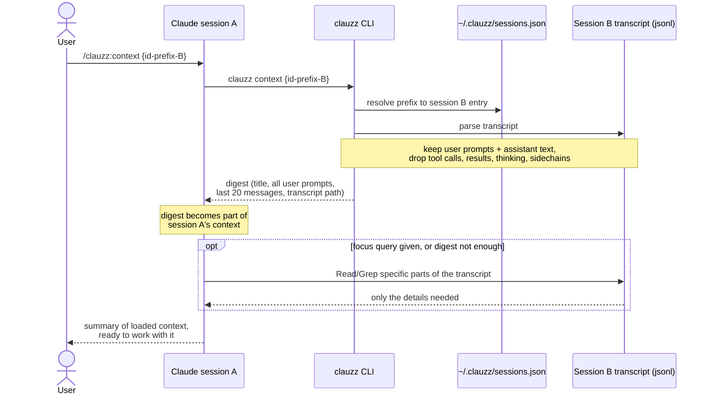

# clauzz


Name and resume your Claude Code sessions.

Claude Code stores sessions as anonymous UUIDs.
`clauzz` maps them to custom names, lists them grouped by directory, and resumes them with one keypress.

## Install

Linux / macOS:

```sh
curl -sSL https://clauzz.muzz-ai.com/install.sh | sh
```

The script downloads the latest release binary for your platform, verifies its checksum, installs it, and installs the Claude Code slash commands.
Windows is not supported (resume uses `exec(2)`).

With Go installed:

```sh
go install github.com/ghulammuzz/clauzz-cli@latest
```

Or build from source:

```sh
go build -o clauzz . && mv clauzz /usr/local/bin/
```

### Uninstall

```sh
curl -sSL https://clauzz.muzz-ai.com/uninstall.sh | sh
```

Removes the binary and the slash commands.
The session registry at `~/.clauzz` is kept; add `| sh -s -- --purge` to remove it too.

### Slash command (optional)

To use `/clauzz:add-session {name}`, `/clauzz:context {id-prefix}`, and `/clauzz:list` from inside Claude Code:

```sh
mkdir -p ~/.claude/commands/clauzz && cp claude-command/*.md ~/.claude/commands/clauzz/
```

## Usage

| Command | What it does |
|---------|--------------|
| `clauzz` | Interactive picker. Enter resumes the session via `claude --resume` in its directory |
| `clauzz add {name}` | Register the current Claude session under a custom name |
| `clauzz list` | Plain list of registered sessions, grouped by directory |
| `clauzz rename {id-prefix} {new-name}` | Rename a registered session |
| `clauzz context {id-prefix}` | Print a context digest of a session (used by `/clauzz:context`) |
| `clauzz rm {id-prefix}` | Remove a session from the registry (min 4 chars of the session ID); `delete` is an alias |
| `clauzz --help` | Show help |

Example:

```
$ clauzz list
/Users/me/code/app
  Task Kafka                     625e4b2e   2026-07-09 10:12
  Task DB Replica                84409ceb   2026-07-08 21:30
/Users/me/code/app/membership
  Feat Membership List           bdd3bcef   2026-07-09 09:01

$ clauzz rm 8440
removed "Task DB Replica" (84409ceb) in /Users/me/code/app
```

## How it works

- Registry lives at `~/.clauzz/sessions.json`.
- `add` resolves the current session from `$CLAUDE_SESSION_ID`, falling back to the newest session transcript in `~/.claude/projects/{encoded-cwd}/`.
- Entries whose transcript was deleted show `[gone]` and cannot be resumed; remove them with `clauzz rm`.
- Removing an entry never touches the Claude session itself.
- `/clauzz:context {id-prefix} [focus query]` injects a digest of another session into the active one: its title, every user prompt, and the last 20 messages (truncated). With a focus query (e.g. `/clauzz:context 948e consumer group setup`), Claude also greps the source transcript for that topic and loads only the relevant parts. Without one, it falls back to the transcript only when the digest is not enough.

### Context transfer flow

How `/clauzz:context` moves context from session B into the active session A:


