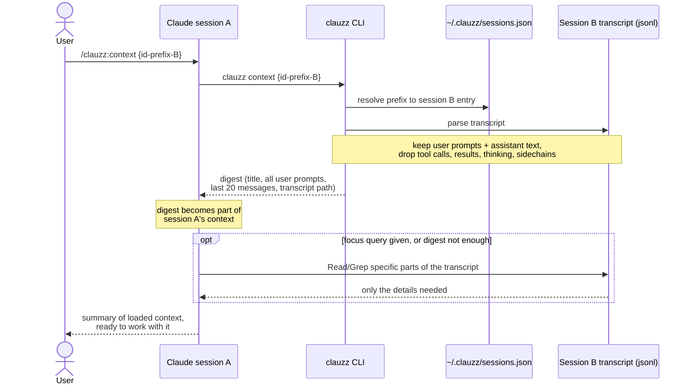

# clauzz


[](https://github.com/ghulammuzz/clauzz-cli/releases/latest)
[](https://github.com/ghulammuzz/clauzz-cli/actions)
[](https://goreportcard.com/report/github.com/ghulammuzz/clauzz-cli)
[](LICENSE)

**Workspace context manager for AI coding agents.**

## Why

clauzz was born from a very normal week at work: a bunch of microservices, and a separate Claude Code session for each fire.
One session chasing a Kafka DLQ, one debugging a payment webhook that double-charges, one staring at replica lag.

Then Monday comes, you run `claude -r`, and it's a wall of UUIDs.
Which one was the webhook fix? No idea. You open three wrong sessions before you find it.

clauzz fixes that loop:

- **Name your sessions**: `Task Kafka DLQ` instead of `3f2a8c1e-...` ([demo](#register-a-session-from-claude-code)).
- **Discover old sessions**: press `a` in the picker to see unregistered sessions with their AI titles; pick one and it is registered and resumed in one go.
- **Resume in one keypress**: a picker grouped by directory; enter drops you back in via `claude --resume`, in the right project ([demo](#pick-a-session-with-clauzz)).
- **Search everything**: "which session talked about idempotency keys?" answered from every transcript on your machine ([demo](#search-across-every-session)).
- **Move context between sessions**: the DLQ session knows things your new session needs? `/clauzz:context` hands them over ([demo](#pull-context-from-another-session)).
- **All without leaving Claude Code**: register, list, and pull context via slash commands.

Claude Code today; adapters for other agents are on the roadmap.

## Install

Requires [Claude Code](https://claude.com/claude-code) installed and logged in. Linux and macOS only (resume uses `exec(2)`).

```sh
curl -sSL https://clauzz.muzz-ai.com/install.sh | sh
```

The script grabs the latest release for your platform, checks the sha256, installs the binary, and drops in the Claude Code slash commands.

<details>
<summary>Other install methods</summary>

With Go installed:

```sh
go install github.com/ghulammuzz/clauzz-cli/cmd/clauzz@latest
```

Build from source:

```sh
go build -o clauzz ./cmd/clauzz && mv clauzz /usr/local/bin/
```

Slash commands only (if you skipped the install script):

```sh
mkdir -p ~/.claude/commands/clauzz && cp claude-command/*.md ~/.claude/commands/clauzz/
```

</details>

## Quick start

```sh
cd your-project && claude                  # 1. work as usual
/clauzz:add-session Payment Fix            # 2. name the session before you leave
clauzz                                     # 3. next day: pick it, hit enter, keep going
/clauzz:context 8b91 retry decisions       # 4. new session needs what the old one knows? pull it in
```

That is the whole loop. Once sessions pile up, `clauzz search {query}` finds the one you forgot to name.

## Usage

### CLI

| Command | What it does |
|---------|--------------|
| `clauzz` | Interactive picker; enter resumes the session via `claude --resume` in its directory. `/` fuzzy-filters, `a` also shows unregistered sessions; picking one registers it under its AI title and resumes |
| `clauzz add {name}` | Register the current Claude session under a custom name |
| `clauzz list` | List registered sessions grouped by directory (`ls` works too); `--all` includes unregistered ones |
| `clauzz search {query}` | Full-text search across every session on the machine |
| `clauzz context {id-prefix} [focus...]` | Print the context digest of a session (powers `/clauzz:context`) |
| `clauzz rename {id-prefix} {new-name}` | Rename a registered session |
| `clauzz rm {id-prefix}` | Remove a session from the registry (`delete` works too) |
| `clauzz prune` | Drop all `[gone]` entries whose transcript was deleted |

Session ID prefixes need at least 4 characters.

### Slash commands (inside Claude Code)

| Command | What it does |
|---------|--------------|
| `/clauzz:add-session {name}` | Register the current session under a custom name |
| `/clauzz:list` | Show registered sessions |
| `/clauzz:context {id-prefix} [focus query]` | Load another session's context into this one |

## Demos

### Register a session from Claude Code

Working on something worth coming back to? Name it before you forget:

1. In your session, type `/clauzz:add-session {name}`, e.g. `/clauzz:add-session Demo Session`.
2. Claude confirms: `Session "Demo Session" registered -> 84409ceb in ...`.
3. From now on it shows up in `clauzz ls` and the picker under that name.

Re-running `/clauzz:add-session` in the same session just renames it.


### Pick a session with `clauzz`

Run `clauzz`, arrow or `j/k` to the session you want, hit enter, and you are back in it - in the right directory.
`/` fuzzy-filters the list; `a` reveals unregistered sessions to adopt.


### Pull context from another session

You are in a fresh session, but the decisions you need live in last week's DLQ session.
Type `/clauzz:context {id-prefix} [what you want from it]` and Claude loads a digest of that session, greps its transcript for your focus topic, and reports back:


### Search across every session

"Which session talked about kafka?" `clauzz search` answers from every transcript on the machine, registered in clauzz or not.


## How it works

- The registry is a single JSON file at `~/.clauzz/sessions.json`; removing an entry never touches the Claude session itself.
- `add` resolves the current session from `$CLAUDE_SESSION_ID`, falling back to the newest transcript in `~/.claude/projects/{encoded-cwd}/`.
- Entries whose transcript was deleted show `[gone]` and cannot be resumed; clean them up with `clauzz rm` or `clauzz prune`.
- The context digest carries the source session's title, every user prompt, and the last 20 messages (truncated).
  With a focus query, Claude also greps the source transcript for that topic and loads only the relevant parts.

### Context transfer flow

How `/clauzz:context` moves context from session B into the active session A:



## Uninstall

```sh
curl -sSL https://clauzz.muzz-ai.com/uninstall.sh | sh
```

Removes the binary and the slash commands.
Your session registry at `~/.clauzz` survives; add `| sh -s -- --purge` if you want it gone too.

## License

[MIT](LICENSE)
